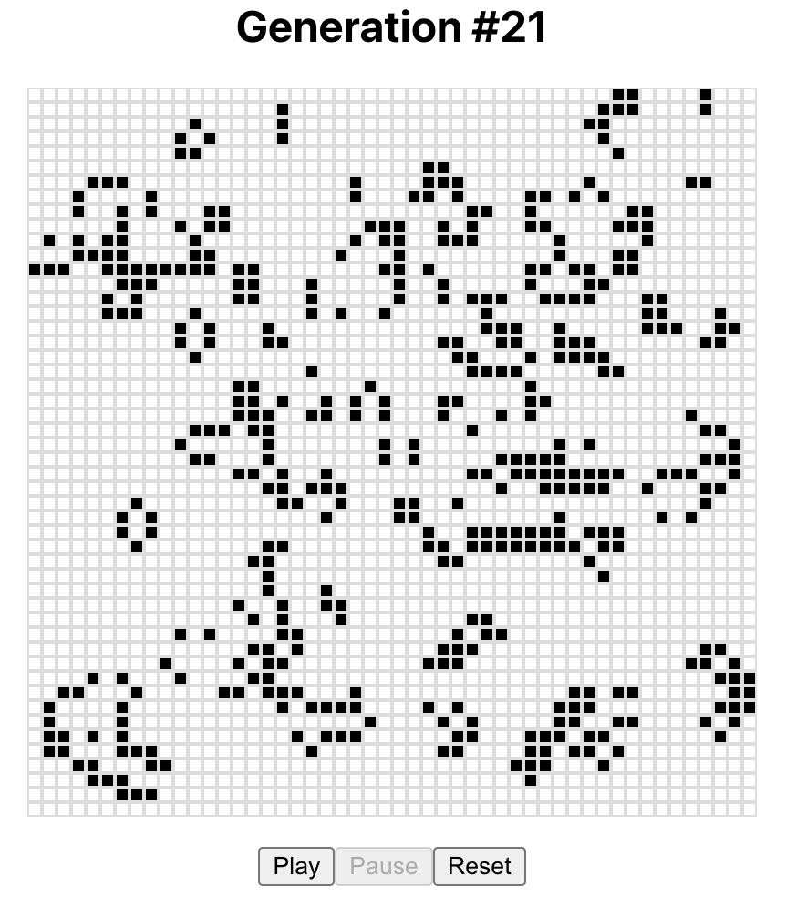

# Game of Life

Basic implementation of the well-known Game of Life.

## Implementation Details

### Game Logic

The business logic of the game itself is framework-agnostic and is stored in [`gameLogic.ts`](./src/game/gameLogic.ts).

Business logic is covered with unit tests in [`gameLogic.test.ts`](./src/game/gameLogic.test.ts).
The tests focus only on public API of the module (the exported methods) and try to check that all rules of the game work as expected.

The app stores board state as 2d array however as future improvement it can be transformed to zero-padded linear array.

### React-specific Notes

Two custom hooks are added to the app as a way to hide implementation details and provide only relevant API for consumers.

`useInterval` is used to run arbitrary callback function with the specified interval.

`useGame` controls the game flow and exposes methods to control the flow from a React component.

More tests should be added to verify that the hooks work as expected but it's out of scope for this task.

### State Management

My first idea was to use Redux for state-management but it felt as an overkill here, so regular component-level state is used for state management.

### Rendering

Flexbox is used to render the grid of cells.
It's not the most performant option but it provides the flexibility to change board size without any additional changes in components code.

## Available Scripts

In the project directory, you can run:

### `npm start`

Runs the app in the development mode.\
Open [http://localhost:3000](http://localhost:3000) to view it in the browser.

The page will reload if you make edits.\
You will also see any lint errors in the console.

### `npm test`

Launches the test runner in the interactive watch mode.\
See the section about [running tests](https://facebook.github.io/create-react-app/docs/running-tests) for more information.

### `npm run build`

Builds the app for production to the `build` folder.\
It correctly bundles React in production mode and optimizes the build for the best performance.

The build is minified and the filenames include the hashes.\
Your app is ready to be deployed!

See the section about [deployment](https://facebook.github.io/create-react-app/docs/deployment) for more information.

### `npm run eject`

**Note: this is a one-way operation. Once you `eject`, you can’t go back!**

If you aren’t satisfied with the build tool and configuration choices, you can `eject` at any time. This command will remove the single build dependency from your project.

Instead, it will copy all the configuration files and the transitive dependencies (webpack, Babel, ESLint, etc) right into your project so you have full control over them. All of the commands except `eject` will still work, but they will point to the copied scripts so you can tweak them. At this point you’re on your own.

You don’t have to ever use `eject`. The curated feature set is suitable for small and middle deployments, and you shouldn’t feel obligated to use this feature. However we understand that this tool wouldn’t be useful if you couldn’t customize it when you are ready for it.

## Learn More

You can learn more in the [Create React App documentation](https://facebook.github.io/create-react-app/docs/getting-started).

To learn React, check out the [React documentation](https://reactjs.org/).
